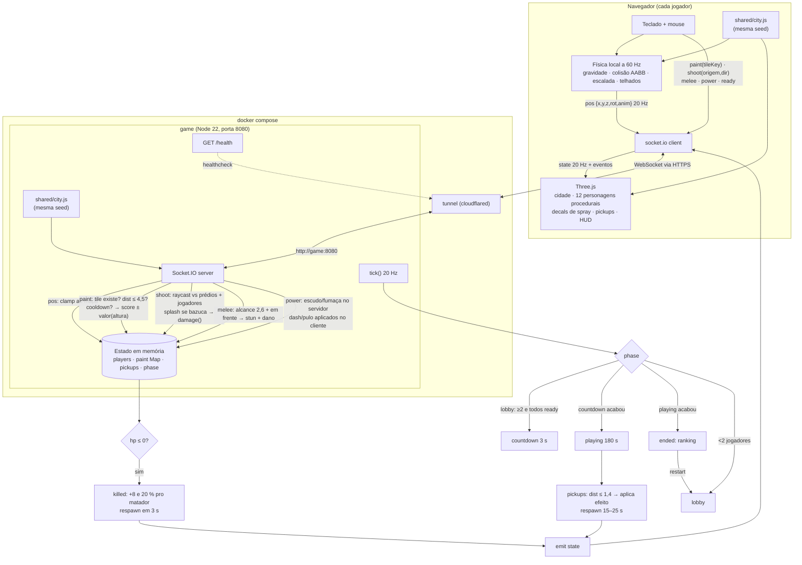

# 🌃 Graffiti de Madrugada

Jogo multiplayer 3D competitivo no navegador, feito para o Hackathon de Jogos
(21/08/2026). De 2 a 12 pichadores disputam uma cidade aberta durante uma noite de
3 minutos: pichar paredes dá pontos (quanto mais alto, mais vale), escalar prédios
libera equipamentos melhores, e armas de tinta, socos e poderes derrubam rivais.
Quando o sol nasce, vence quem tiver mais pontos.

## Como rodar

Só precisa de Docker com Docker Compose.

```bash
docker compose up --build
```

Aguarde a caixa **URL PÚBLICA DO JOGO** no terminal (serviço `tunnel`). Essa URL
`https://*.trycloudflare.com` é o único endereço dos jogadores — não há porta
exposta na máquina. Se rodou com `-d`: `docker compose logs -f tunnel`.

Testes (sem Docker): `npm install && npm test`.

## Como jogar

1. Abra a URL, digite seu nome e clique **Pronto!**. A noite começa quando todos
   no lobby estiverem prontos (mínimo 2).
2. Clique na tela para travar o mouse. Piche, escale, atire, sobreviva.
3. Ao final aparece o ranking; **Voltar ao lobby** reinicia com todos prontos de novo.

| Item | Valor |
| --- | --- |
| Jogadores | 2 a 12, cada um com um modelo de personagem diferente |
| Duração | 3 s de contagem + 3 min |
| Objetivo | Mais pontos ao fim da noite |
| Pontos | Tile de parede: 1 + 1 a cada 6 m de altura · Kill: +8 e 20 % dos pontos da vítima |
| Vida | 100 HP · colete absorve 70 % do dano · respawn em 3 s no seu ponto inicial |

### Controles

| Tecla | Ação |
| --- | --- |
| `WASD` / setas | Andar |
| Mouse | Olhar (câmera em 3ª pessoa) |
| `Espaço` | Pular · segurar encostado numa parede = **escalar** |
| Clique esquerdo | Usar ferramenta atual: spray (pichar a parede na mira) ou atirar |
| `1` / `2` / roda do mouse | Alternar spray ↔ arma |
| `F` | Soco: 25 de dano + atordoa 0,9 s quem estiver na frente |
| `Q` | Poder da sua classe (ver abaixo) |

### Classes e poderes

O poder é definido pela vaga no lobby (`slot % 4`):

| Classe | Poder `Q` | Efeito | Recarga |
| --- | --- | --- | --- |
| Corredor | Disparada | Velocidade 17 por 0,7 s | 5 s |
| Tanque | Escudo | Dano recebido ÷ 2 por 5 s | 12 s |
| Saltador | Super pulo | Pulo quase 2× mais alto | 6 s |
| Fantasma | Fumaça | Quase invisível por 4 s | 14 s |

### Armas e equipamentos (pickups pela cidade)

| Item | Onde | Efeito |
| --- | --- | --- |
| 🔫 Pistola de tinta | Padrão | 14 de dano, tiro instantâneo, 34 m |
| 🚀 Bazuca de tinta | Telhado das torres | 45 de dano em área (4,5 m), 4 disparos |
| 🦺 Colete | Ruas e telhados de lojas | +50 de armadura |
| 👟 Tênis turbo | Ruas | Anda e escala 50 % mais rápido por 12 s |
| 🎨 Lata 2x | Ruas | Tiles valem o dobro por 15 s |
| ➕ Kit | Ruas e telhados | +60 HP |

Pickups reaparecem 15–25 s depois de pegos.

## Como funciona



Divisão de autoridade: o **servidor** decide tudo que pontua ou fere (pintura,
tiros, socos, pickups, vida, fases). O **cliente** simula o próprio movimento
(gravidade, colisão, escalada) e só reporta posição — rápido o bastante para um
hackathon e sem precisar replicar física no servidor. A cidade é gerada pela mesma
seed nos dois lados, então o servidor valida qualquer tile que o cliente pedir.

## Estrutura

```
server.js          regras, combate, fases, Socket.IO, /health — exporta createGame()
shared/city.js     gerador determinístico da cidade, spawns, pickups, tiles de parede
public/index.html  HUD, lobby, overlays
public/game.js     Three.js: cidade, personagens, câmera, física, escalada, efeitos
test/              node:test — unitário (cidade) e integração (servidor via socket.io-client)
Dockerfile         node:22-alpine
compose.yaml       game + tunnel (Cloudflare Quick Tunnel)
tunnel/            imagem do cloudflared que imprime a URL pública
docs/spec.md       especificação usada para orientar o desenvolvimento
```

## Stack

Node 22 + Express 5 + Socket.IO 4 no servidor; Three.js (servido de
`node_modules` pelo container, sem CDN) e Canvas 2D para texturas no cliente. Sem
bundler. Modelos de personagem, prédios, texturas e decals são todos procedurais —
nenhum asset externo, nenhuma licença de terceiros.

## Fora do escopo

Login, ranking persistente, áudio, controles de toque, física no servidor,
anti-cheat de movimento.
