# Graffiti de Madrugada

[](https://github.com/samuelrms/graffiti-de-madrugada/actions/workflows/ci.yml)
[](https://graffitidemadrugada.samuelramos.dev/)

**Jogue agora: <https://graffitidemadrugada.samuelramos.dev/>** (plano free: o primeiro acesso pode levar ~40 s para acordar o servidor).

Jogo multiplayer 3D competitivo no navegador. De 2 a 12 pichadores por sala
disputam uma cidade aberta durante uma noite de 3 minutos: pichar paredes dá
pontos (quanto mais alto, mais vale), escalar prédios libera equipamentos
melhores, e armas de tinta, socos e poderes derrubam rivais. Quando o sol nasce,
vence quem tiver mais pontos.

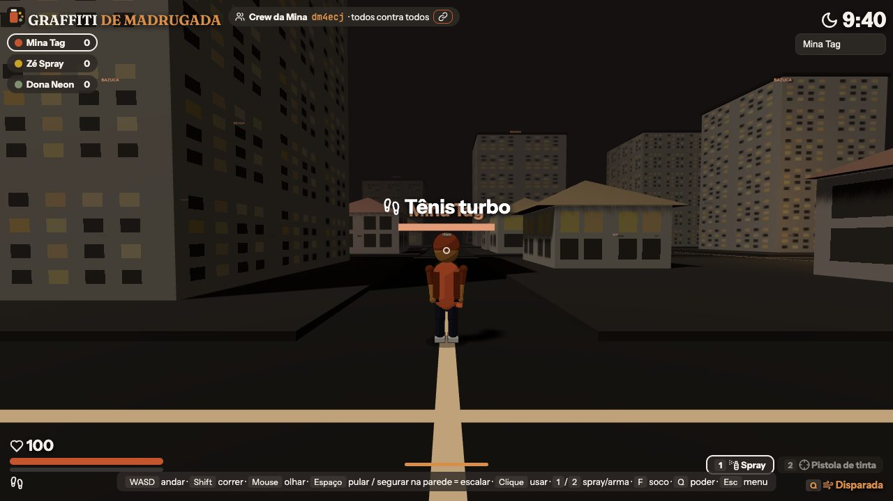

| | |
| --- | --- |
| 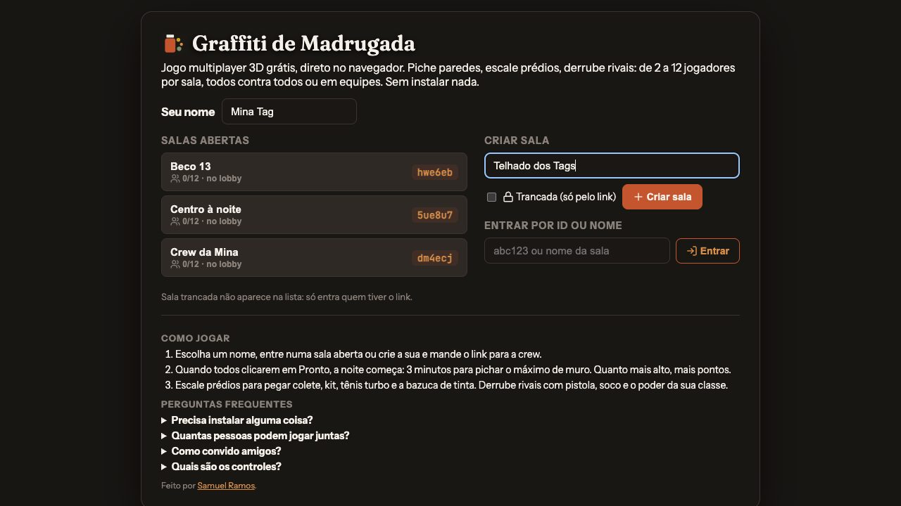 Home: salas abertas, criar sala (trancada ou não), entrar por ID ou nome | 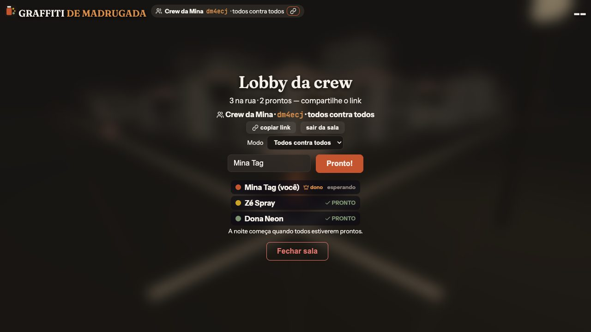 Lobby da sala: nome, link, dono escolhe o modo, "Pronto!" de todos |
| 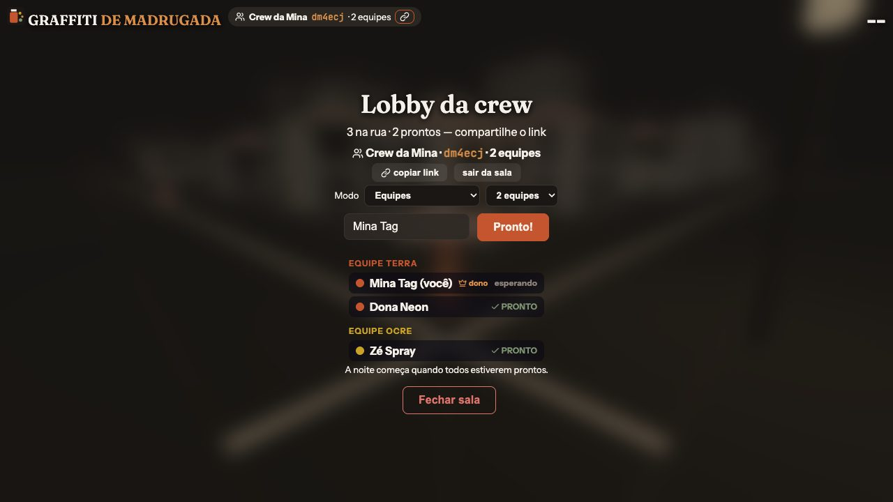 Modo equipes: 2 a 4 times balanceados, cor por equipe, sem fogo amigo |  Cidade procedural: casas, lojas e torres para escalar |
| 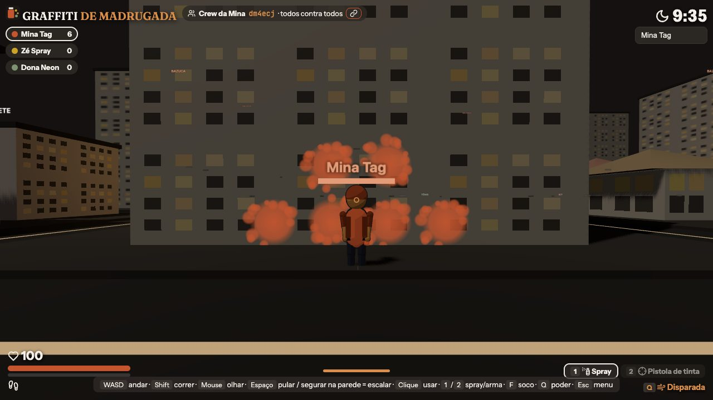 Spray na parede — tiles valem mais quanto mais alto | 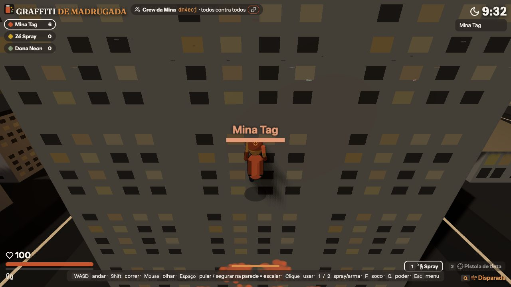 Segurar Espaço na parede = escalar |
| 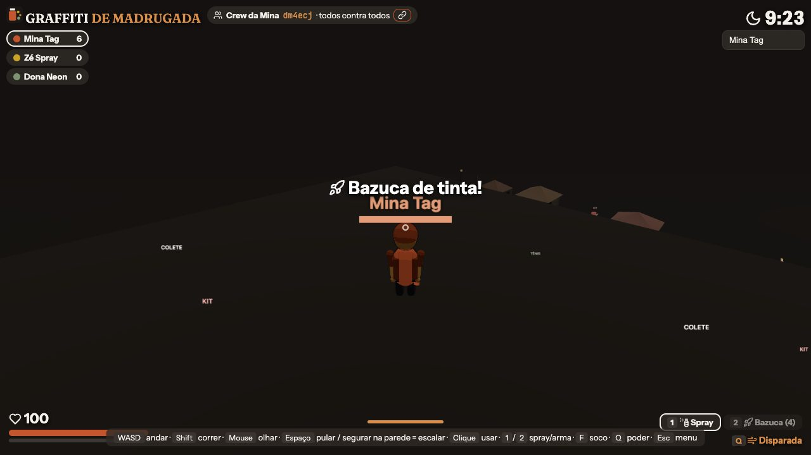 Bazuca de tinta espera no topo das torres | 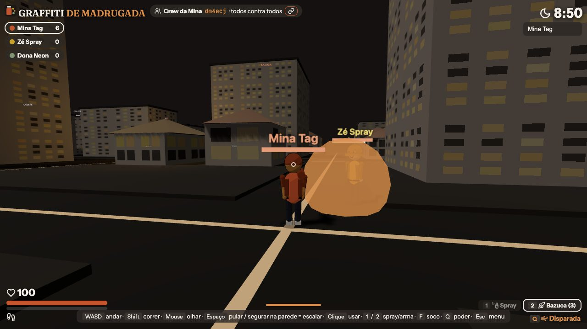 Pistola, bazuca, soco e poderes |
| 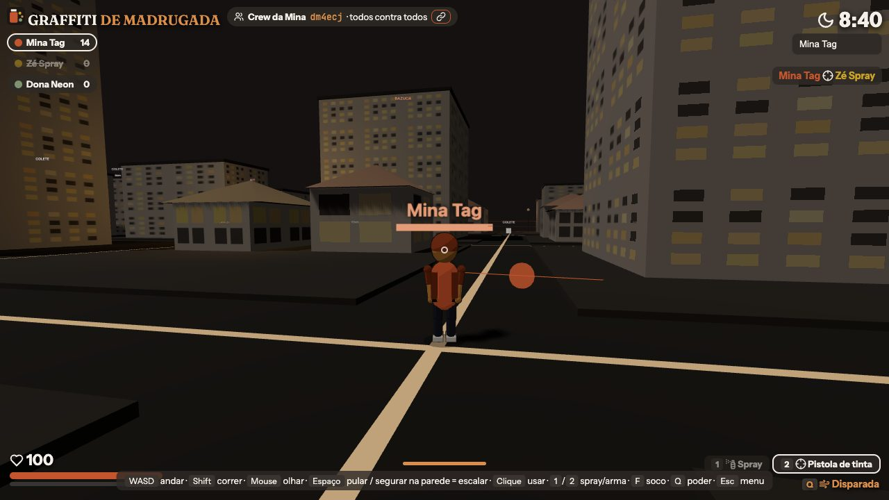 Kill feed com nomes e ranking ao vivo | 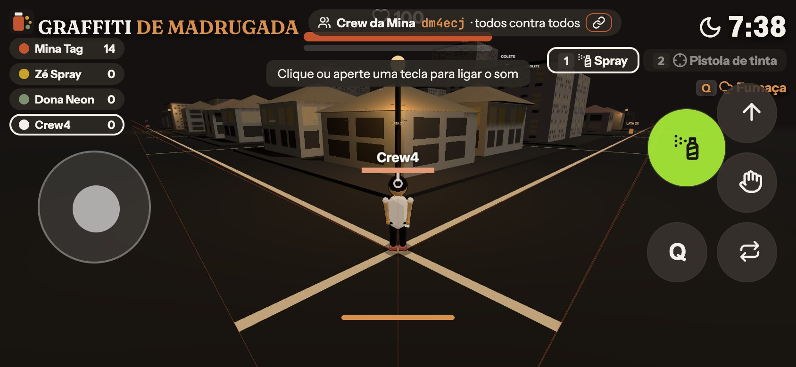 Celular: joystick, arrastar para olhar, botões |
| 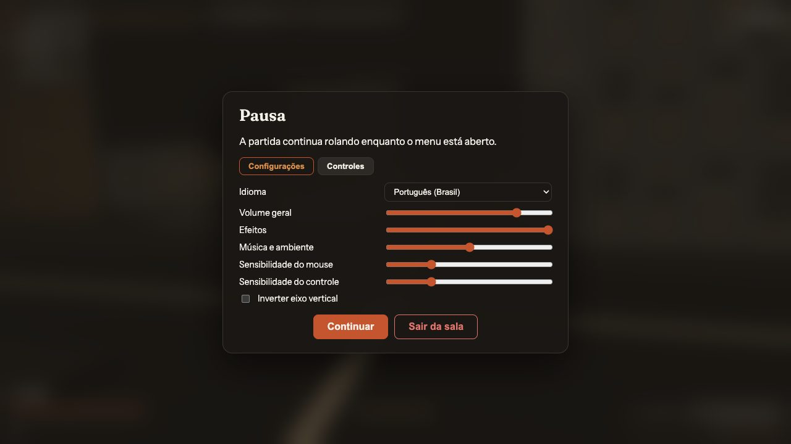 Esc: idioma, volumes, sensibilidade, controles | |

Prints gerados automaticamente por `pnpm screenshots` (Chrome headless jogando de verdade).

## Como rodar

Só precisa de Docker com Docker Compose:

```bash
docker compose up --build
```

Aguarde a caixa **URL PÚBLICA DO JOGO** no terminal (serviço `tunnel`). Essa URL
`https://*.trycloudflare.com` é o único endereço dos jogadores — não há porta
exposta na máquina. Se rodou com `-d`: `docker compose logs -f tunnel`.

Desenvolvimento local (Node ≥ 22, pnpm via corepack):

```bash
corepack enable
pnpm install
pnpm dev        # servidor TS com reload (8080) + Vite (5173) com proxy do socket
pnpm build      # dist/server (tsc) + dist/public (vite)
pnpm start      # roda o build
```

## Como jogar

1. Abra o link, digite seu nome. Na **home**, entre numa sala aberta, crie a sua
   (marque **Trancada** para que só entre quem tiver o link) ou digite o ID/nome.
2. No lobby, **copiar link** manda a sala para a crew; clique **Pronto!**. A noite
   começa quando todos estiverem prontos (mínimo 2).
3. Clique na tela para travar o mouse. Piche, escale, atire, sobreviva.
4. Ao final aparece o ranking; **Voltar ao lobby** reinicia com todos prontos de novo.

### Salas

- Cada sala é uma partida isolada com ID de 6 caracteres (`#r=abc123` na URL).
- Salas públicas aparecem na home (atualiza a cada 3 s) e podem ser acessadas pelo
  nome; salas **trancadas** só pelo ID/link e nunca aparecem na lista.
- **Dono**: quem entra primeiro. Escolhe o modo no lobby e pode **fechar a sala**
  (todos voltam para a home). Se sair ou fechar a aba, o dono passa para quem está
  há mais tempo na sala. Quando o último sai, a sala é destruída na hora (sala
  criada e nunca usada some em 1 min). Até 12 jogadores por sala.
- **Um jogador por navegador**: abrir o jogo em outra aba não cria outro
  personagem (token por navegador). Por padrão também **um jogador por IP**
  (`MAX_PER_IP=1`); para eventos em que todo mundo divide o mesmo Wi-Fi/NAT,
  suba o valor (`MAX_PER_IP=0` = sem limite) no `compose.yaml`/Render.

### Modos

| Modo | Regras |
| --- | --- |
| Todos contra todos (padrão) | Cada um por si; tiles e kills contam para o jogador |
| Equipes (2, 3 ou 4) | Jogadores distribuídos em rodízio pela ordem de entrada (diferença máxima de 1 por time); cor e spray da equipe; sem fogo amigo; pichar tile do próprio time não pontua; vence a equipe com mais pontos somados |

| Item | Valor |
| --- | --- |
| Jogadores | 2 a 12 por sala, cada um com um modelo de personagem diferente |
| Duração | 3 s de contagem + 3 min |
| Objetivo | Mais pontos ao fim da noite |
| Pontos | Tile de parede: 1 + 1 a cada 6 m de altura · Kill: +8 e 20 % dos pontos da vítima |
| Vida | 100 HP · colete absorve 70 % do dano · respawn em 3 s no seu ponto inicial |

### Controles

| Tecla | Ação |
| --- | --- |
| `WASD` / setas | Andar (7 m/s) |
| `Shift` | Correr (10,5 m/s) |
| Mouse | Olhar (câmera em 3ª pessoa) |
| `Espaço` | Pular · segurar encostado numa parede = **escalar** |
| Clique esquerdo | Usar ferramenta atual: spray (pichar a parede na mira) ou atirar |
| `1` / `2` / roda do mouse | Alternar spray ↔ arma |
| `F` | Soco: 25 de dano + atordoa 0,9 s quem estiver na frente |
| `Q` | Poder da sua classe (ver abaixo) |
| `Esc` | Menu: continuar, configurações (idioma, volumes, sensibilidade, inverter eixo), controles, sair da sala |

**Controle (gamepad)** — Xbox, PlayStation e Steam Deck (mapeamento padrão):
analógico esquerdo anda, direito olha, `A`/Cross pula e escala, `RT` picha ou
atira, `B`/Círculo troca spray e arma, `X`/Quadrado soco, `Y`/Triângulo poder,
`LB` ou `L3` corre, `Start` abre o menu.

No celular/tablet: joystick virtual na metade esquerda (empurrar até a borda =
correr), arrastar na metade direita para olhar, e botões usar, pular/escalar,
soco, Q e trocar ferramenta.

### Personagens

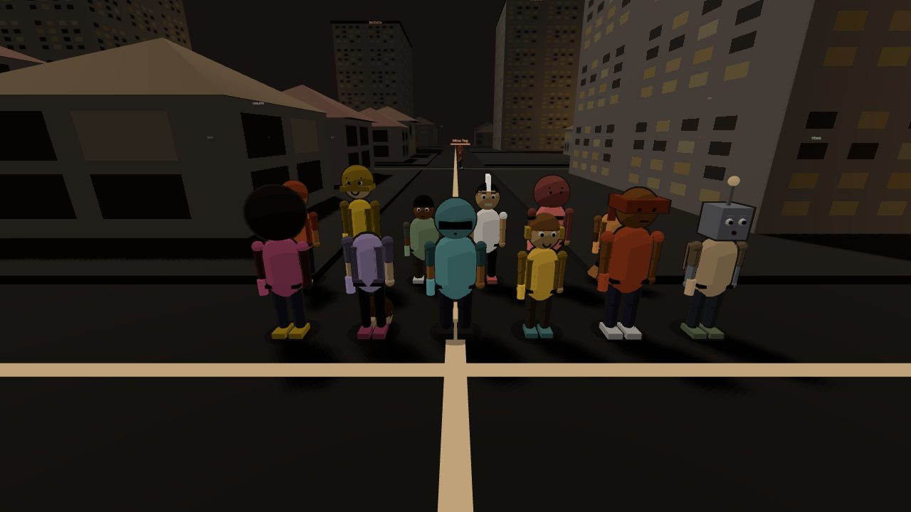

Doze visuais procedurais (boné, gorro, moicano, capuz, bucket, afro, rabo de
cavalo, capacete, fone, bandana, robô…), cada um com rosto, tênis, jaqueta e
cabelo próprios. Corpo articulado (quadril, joelho, ombro, cotovelo) com
animação de corrida, sprint, escalada, pulo, pintura e respiração parada.
Cel-shading de 3 tons com contorno. Nada é baixado: tudo é gerado em código.

### Identidade visual

Mesma paleta do [samuelramos.dev](https://samuelramos.dev): superfícies em
carvão e terra escura, terracota só para ação e traço, papel para texto, sálvia
para "ok", ocre para atenção. Sem azul, verde ou cinza frio na interface;
profundidade vem de superfície + borda de 1px, nunca de brilho. Fontes Fraunces
(títulos), Instrument Sans (texto) e JetBrains Mono (IDs). As equipes seguem a
paleta: Terra, Ocre, Sálvia e Papel.

### Idiomas e som

Interface em **português (Brasil)** e **inglês**: detecta o idioma do navegador e
dá para trocar no menu (`Esc`). Efeitos sonoros posicionais (passos, pulo,
escalada, tiros, explosões, socos, spray, pickups, poderes), jingles de início,
kill, morte, vitória e derrota, ambiente urbano e ticks da contagem. Volumes
separados para geral, efeitos e música. O som liga no primeiro clique ou tecla
(exigência dos navegadores).

Todos os samples vêm da [Kenney](https://kenney.nl) (Impact Sounds, Sci-Fi
Sounds, Interface Sounds, RPG Audio, Music Jingles), licença **CC0 1.0**; ver
`src/client/public/audio/CREDITS.txt`. O chiado do spray é sintetizado em tempo
real com a Web Audio API.

### Classes e poderes

O poder é definido pela vaga no lobby (`slot % 4`):

| Classe | Poder `Q` | Efeito | Recarga |
| --- | --- | --- | --- |
| Corredor | Disparada | Velocidade 17 por 0,7 s | 5 s |
| Tanque | Escudo | Dano recebido ÷ 2 por 5 s | 12 s |
| Saltador | Super pulo | Pulo quase 2× mais alto | 6 s |
| Fantasma | Fumaça | Quase invisível por 4 s | 14 s |

### Armas e equipamentos (pickups pela cidade)

| Item | Onde | Efeito |
| --- | --- | --- |
| Pistola de tinta | Padrão | 14 de dano, tiro instantâneo, 34 m |
| Bazuca de tinta | Telhado das torres | 45 de dano em área (4,5 m), 4 disparos |
| Colete | Ruas e telhados de lojas | +50 de armadura |
| Tênis turbo | Ruas | Anda, corre e escala 50 % mais rápido por 12 s |
| Lata 2x | Ruas | Tiles valem o dobro por 15 s |
| Kit | Ruas e telhados | +60 HP |

Pickups reaparecem 15–25 s depois de pegos.

## Como funciona

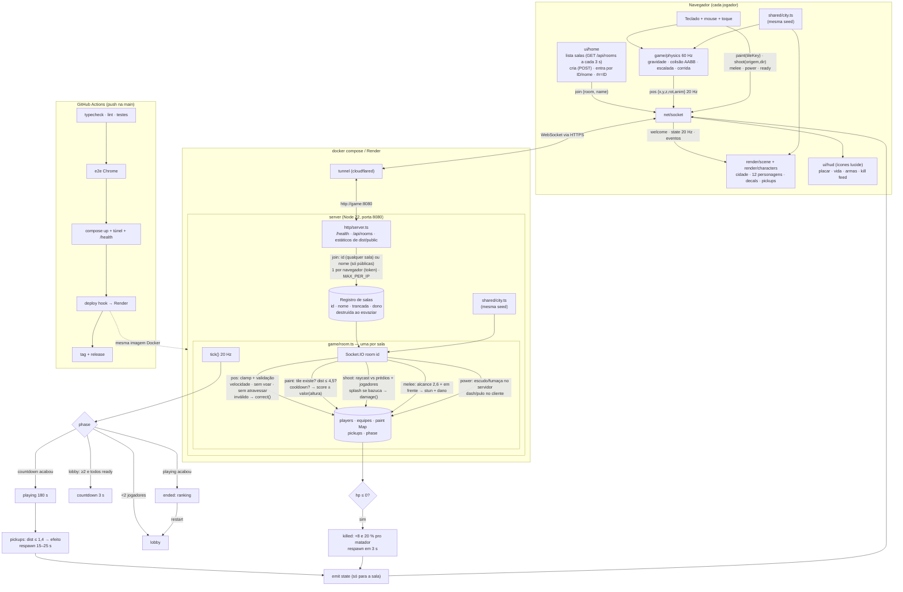

Divisão de autoridade: o **servidor** decide tudo que pontua ou fere (pintura,
tiros, socos, pickups, vida, fases) e isola cada sala. O **cliente** simula o
próprio movimento (gravidade, colisão, escalada) e reporta posição; o servidor
checa cada posição contra limites físicos — velocidade máxima (com folga para lag
e empurrões), nada de atravessar prédio, nada de pairar acima de 7 m sem parede ou
telhado por perto (cair é sempre permitido) — e, se não bate, mantém a última
posição válida e manda o cliente voltar (`correct`). A cidade é gerada pela mesma
seed nos dois lados, então o servidor valida qualquer tile que o cliente pedir.

## Estrutura

```
src/
  shared/            código compartilhado servidor ↔ cliente
    city.ts          gerador determinístico da cidade, spawns, pickups, tiles de parede
    protocol.ts      tipos de todos os eventos do socket e da API (fonte única da verdade)
  server/
    index.ts         entrada: serve dist/public e sobe o servidor
    http/server.ts   Express + Socket.IO, /health, /api/rooms, robots/sitemap, redirect canônico, salas
    game/room.ts     uma partida: jogadores, pintura, combate, pickups, fases
    game/config.ts   constantes de balanceamento (armas, poderes, pickups, limites)
    game/geometry.ts raycast contra prédios/jogadores e validação de movimento
  client/
    index.html       página, SEO (canonical, Open Graph, Twitter, JSON-LD), favicon, manifest
    main.ts          loop de simulação (timer) e de render (rAF)
    style.css        HUD, home, lobby, toque
    core/state.ts    estado mutável compartilhado entre módulos do cliente
    core/settings.ts idioma, volumes, sensibilidade (localStorage)
    core/i18n.ts     dicionários pt-BR/en, t() e data-i18n
    audio/audio.ts   Web Audio: samples CC0, spray sintetizado, som posicional, ambiente
    game/gamepad.ts  Gamepad API (Xbox/PlayStation/Steam Deck)
    net/socket.ts    cliente Socket.IO tipado + handlers dos eventos
    game/physics.ts  física local, câmera, mira
    game/input.ts    teclado, mouse (pointer lock), toque
    render/scene.ts  Three.js: cidade, luzes, decals de spray, pickups, efeitos
    render/characters.ts  12 personagens procedurais e animação
    ui/hud.ts        placar, vida, armas, lobby, fim de partida, kill feed
    ui/home.ts       home: lista/cria/entra em salas, deep link #r=ID
    ui/icons.ts      ícones lucide → SVG inline
    ui/pause.ts      menu de pausa: configurações e tabela de controles
    public/          favicon, manifest, imagem Open Graph, audio/ (CC0 + créditos)
test/                node:test — unitário (cidade), integração (socket.io-client), e2e (Chrome)
tools/               harness puppeteer-core: prints do README e apoio ao e2e
.github/workflows    CI/CD: typecheck, lint, testes, e2e, stack Docker, deploy, release
Dockerfile           multi-stage: build (pnpm + tsc + vite) → runtime só com deps de produção
compose.yaml         game + tunnel (Cloudflare Quick Tunnel)
render.yaml          blueprint Render: web service Docker free, health check /health
```

## Stack

- **TypeScript** em tudo (`strict`), sem `any` cruzando o socket: `shared/protocol.ts`
  tipa os dois lados.
- **Servidor**: Node 22 + Express 5 + Socket.IO 4, compilado com `tsc`.
- **Cliente**: Three.js + [lucide](https://lucide.dev) (ícones SVG) empacotados com
  **Vite**. Modelos, prédios, texturas e decals são procedurais — nenhum asset
  externo. Personagens têm esqueleto simples (quadril, joelho, ombro, cotovelo),
  membros em cápsula, rosto, tênis, jaqueta e 12 visuais; `MeshToonMaterial` com
  rampa de 3 tons + contorno por casco invertido nas partes grandes (≈20 meshes
  por personagem, leve mesmo com 12 em cena).
- **pnpm** (corepack) em dev, CI e Docker.
- Outras linguagens: nada no jogo justifica hoje — o custo está no render do
  navegador, não no servidor. A divisão `shared/` deixa o caminho aberto para um
  módulo WASM de física se um dia fizer sentido.

## Testes e CI

| Camada | Comando | O que cobre |
| --- | --- | --- |
| Tipos + lint | `pnpm typecheck` · `pnpm lint` | `tsc --noEmit` nos três alvos; ESLint com typescript-eslint |
| Unitário | `pnpm test` | `shared/city.ts`: determinismo, prédios sem sobreposição e dentro do mapa, spawns fora de prédios, tiles/chaves, valor por altura |
| Integração | `pnpm test` | servidor via socket.io-client: salas (criar, listar só públicas, entrar por ID/nome, trancada só por ID, isolamento, destruição ao esvaziar, IDs sem caracteres ambíguos), um por navegador e por IP, dono (passagem, modo, fechar), equipes (balanceamento, cores, sem fogo amigo, vencedor por equipe), lobby/ready, 13º rejeitado, pintura (alcance, cooldown, roubo), tiros/kill/respawn, bloqueio por prédio, soco, colete/kit, bazuca, escudo, fim/restart, clamp e validação de movimento |
| E2E | `pnpm test:e2e` | dois Chromes headless: home → cria sala trancada (não listada) → entra pelo link → segunda aba recusada → dono troca para equipes e volta → andar (sem correções do servidor) → pichar pela mira → menu de pausa e troca de idioma → escalar → matar → kill feed → respawn → dono sai e passa a sala → último sai e a sala some |

GitHub Actions ([`.github/workflows/ci.yml`](.github/workflows/ci.yml)) em todo
push/PR na `main`: typecheck + lint + testes → e2e → `docker compose up --build`,
espera `game` healthy, `/health`, página servida, túnel responde de fora. Em push
na `main`, com tudo verde: deploy hook do Render, `/health` na URL pública, e uma
**tag + release** automática (`v<versão>-r<nº do run>`, notas geradas pelo GitHub).

## Deploy (Render, plano free)

Host: **Render** free web service (Docker). Custo zero, WebSocket nativo, roda o
`Dockerfile` como está. Pegadinha do free: dorme após ~15 min sem acesso e o
primeiro acesso demora 30–50 s. Estado vive em memória: sempre uma instância só.
O túnel do Cloudflare continua sendo o caminho do hackathon (`docker compose`);
no Render a URL é direta: <https://graffiti-de-madrugada.onrender.com>.

Configuração única (painel do Render, sem cartão): **New → Blueprint** → este
repositório → o [`render.yaml`](render.yaml) cria o serviço (auto-deploy desligado:
quem publica é o CI). Depois, no serviço: **Settings → Deploy Hook → copiar** e
`gh secret set RENDER_DEPLOY_HOOK`. Se o domínio for outro:
`gh variable set RENDER_URL --body https://SEU.dominio`.

### Domínio próprio e SEO

O plano free do Render aceita domínio personalizado com TLS automático:

1. No serviço: **Settings → Custom Domains → Add** → `graffitidemadrugada.samuelramos.dev`.
2. No Cloudflare (DNS de `samuelramos.dev`): registro **CNAME**, nome
   `graffitidemadrugada`, destino `graffiti-de-madrugada.onrender.com`, **Proxy
   desligado** (nuvem cinza, "DNS only") até o Render emitir o certificado.
3. Espere o Render mostrar o domínio como verificado com certificado (alguns
   minutos). Se o Render pedir um registro TXT extra, adicione também.
4. Opcional: ligar o proxy do Cloudflare (nuvem laranja). Aí em **SSL/TLS** use
   o modo **Full (strict)**; WebSocket passa normalmente pelo proxy.
5. O redirect do endereço antigo já vem ligado no `render.yaml`
   (`CANONICAL_REDIRECT=1`): páginas em `*.onrender.com` respondem 301 para o
   domínio; `/health` e o socket não são redirecionados. O CI valida o deploy
   no domínio final.

A URL canônica vem de `PUBLIC_URL` (servidor) e `VITE_PUBLIC_URL` (cliente, no
build). O padrão é o domínio acima; `.env` e `render.yaml` já trazem os valores.

O que está coberto para buscadores, redes sociais e assistentes de IA:

| Camada | Onde |
| --- | --- |
| `title`, `description`, `keywords`, `robots`, `canonical`, `theme-color`, manifest com categorias e screenshot | `src/client/index.html`, `public/manifest.webmanifest` |
| Open Graph completo (imagem 1280×720 com alt) e Twitter Card | `index.html` |
| JSON-LD `@graph`: `WebSite`, `Person`, `VideoGame` (grátis, 2–12 jogadores, plataforma, repositório) e `FAQPage` | `index.html` |
| Conteúdo real sem JS: `h1`, resumo, "Como jogar" e FAQ visíveis na home | `index.html` |
| `robots.txt` liberando buscadores e crawlers de IA (GPTBot, ClaudeBot, PerplexityBot, Google-Extended…), `sitemap.xml`, `llms.txt`, `.well-known/security.txt` | `src/server/http/server.ts` |
| Redirect 301 do host antigo, gzip/brotli, `Cache-Control` imutável para assets com hash e `no-cache` no HTML | `server.ts` |

Para fechar o ciclo fora do código: enviar o sitemap no Google Search Console e
no Bing Webmaster Tools, e validar o preview do link no LinkedIn Post Inspector.

## Fora do escopo

Login, ranking persistente, física completa no servidor (o servidor valida
plausibilidade, não simula), persistência de salas entre reinícios.
