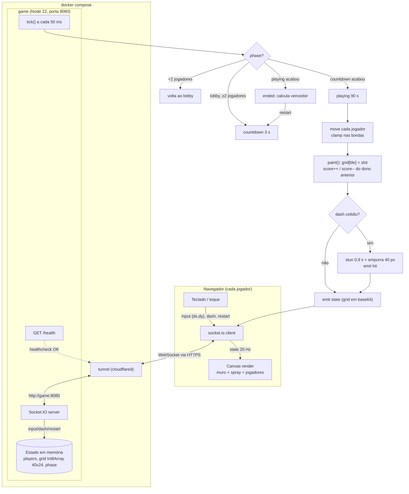

# 🌃 Graffiti de Madrugada

Jogo multiplayer competitivo no navegador para o Hackathon de Jogos (21/08/2026).

De 2 a 5 pichadores disputam o mesmo muro durante uma noite de 90 segundos. Andar
deixa spray da sua cor; passar por cima do spray alheio rouba o pedaço. Com
**Espaço** você dá um empurrão: quem for atingido derruba a lata e fica parado por
quase um segundo. Quando o sol nasce, vence quem tiver a maior área do muro.

## Como rodar

Só precisa de Docker com Docker Compose.

```bash
docker compose up --build
```

Aguarde a caixa **URL PÚBLICA DO JOGO** no terminal (serviço `tunnel`). Essa URL
`https://*.trycloudflare.com` é o único endereço dos jogadores — não há porta
exposta na máquina.

Se rodou com `-d`, recupere a URL com:

```bash
docker compose logs -f tunnel
```

## Como jogar

| Item | Valor |
| --- | --- |
| Jogadores | 2 a 5 (a partida começa sozinha quando o segundo entra) |
| Duração | 3 s de contagem + 90 s de partida |
| Objetivo | Ter mais pedaços de muro pichados quando o tempo acabar |
| Reinício | Botão **Outra noite** na tela final (qualquer jogador) |

### Controles

| Tecla | Ação |
| --- | --- |
| `WASD` ou `← ↑ ↓ →` | Andar e pichar o muro |
| `Espaço` | Empurrão (dash curto). Atordoa quem estiver no caminho. Recarga de 1,5 s |
| Campo "Seu nome" | Troca o nome exibido |

No celular aparecem botões de toque (setas + EMPURRA).

### Regras

- Cada pedaço do muro pertence ao último que passou por ele. Roubar pedaço tira
  ponto do rival.
- Jogador atordoado não anda, não picha e não empurra por 0,9 s, e é deslocado
  40 px na direção do empurrão.
- Se a partida ficar com menos de 2 jogadores, volta para o lobby.
- Empate na contagem de pedaços = empate declarado.

## Como funciona



O servidor é autoritativo: o cliente só envia intenção (direção, dash, restart)
e desenha o último snapshot recebido. Nenhuma regra roda no navegador.

## Estrutura

```
server.js        regras, loop de 20 Hz, Socket.IO, /health
public/index.html cliente canvas puro + Socket.IO (sem build)
Dockerfile       node:22-alpine
compose.yaml     game + tunnel (Cloudflare Quick Tunnel)
tunnel/          imagem do cloudflared que imprime a URL pública
docs/spec.md     especificação usada para orientar o desenvolvimento
```

## Stack

Node 22 + Express 5 + Socket.IO 4 no servidor; HTML + Canvas 2D puro no
cliente. Sem framework de jogo, sem build, sem dependências além das duas acima.

## Fora do escopo

Login, ranking, persistência, áudio, power-ups, mapas extras, salas múltiplas.
